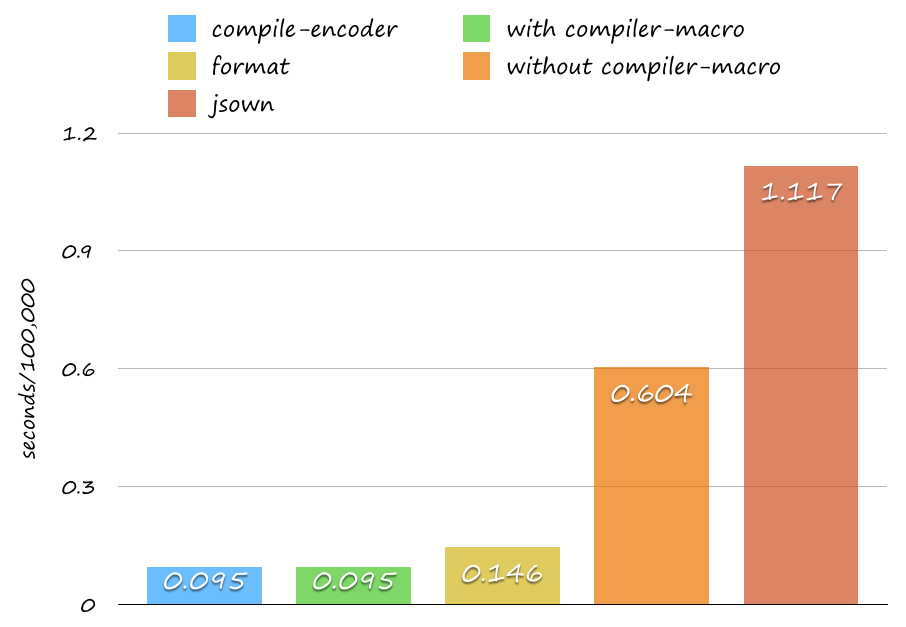

# Jonathan

JSON encoder and decoder.  
Using cl-cookie.util to write JSON parser.

## Usage

```Lisp
(to-json '(:name "Common Lisp" :born 1984 :impls (SBCL KCL)))
;; => "{\"NAME\":\"Common Lisp\",\"BORN\":1984,\"IMPLS\":[\"SBCL\",\"KCL\"]}"

(parse "{\"NAME\":\"Common Lisp\",\"BORN\":1984,\"IMPLS\":[\"SBCL\",\"KCL\"]}")
;; => (:NAME "Common Lisp" :BORN 1984 :IMPLS ("SBCL" "CCL" "KCL"))

(parse "{\"NAME\":\"Common Lisp\",\"BORN\":1984,\"IMPLS\":[\"SBCL\",\"KCL\"]}"
       :as :alist)
;; => (("NAME" . "Common Lisp") ("BORN" . 1984) ("IMPLS" "SBCL" "CCL" "KCL"))
```

## to-json
  - can encode retricted Property List into JSON string.

```Lisp
(to-json '(:name :age :born :impls))
;; => "{\"NAME\":\"AGE\",\"BORN\":\"IMPLS\"}"
;; not "[\"NAME\",\"AGE\",\"BORN\",\"IMPLS\"]"

(to-json '(:name "Common Lisp" :born))
;; => "{\"NAME\":\"Common Lisp\",\"BORN\":[]}"
```

  - is customizable by `%to-json`, `%write-char` and `%write-string`.

```Lisp
(defclass user ()
  ((id :type integer :initarg :id)
   (name :type string :initarg :name))
  (:metaclass <dao-table-class>))

(defmethod %to-json ((user user))
  (%write-char #\{)
  (%to-json "id")
  (%write-char #\:)
  (%to-json (slot-value user 'id))
  (%write-char #\,)
  (%to-json "name")
  (%write-char #\:)
  (%to-json (slot-value user 'name))
  (%write-char #\}))

(to-json (make-instance 'user :id 1 :name "Rudolph"))
;; => "{\"id\":1,\"name\":\"Rudolph\"}"
```


```Lisp
(let ((data '(:obj ("HELLO" . "WORLD"))))
  (time
   (dotimes (_ 100000)
     (jsown:to-json data))))
;; => 0.25

(let ((data '(:hello :world)))
  (time
   (dotimes (_ 100000)
     (jonathan:to-json data))))
;; => 0.126
```

## parse
  - can decode JSON string into Property List or Association List specified by `:as`.

## See Also
 - [cl-cookie.util](https://github.com/fukamachi/cl-cookie/blob/master/src/util.lisp)

## Author

* Rudolph-Miller

## Copyright

Copyright (c) 2015 Rudolph-Miller
